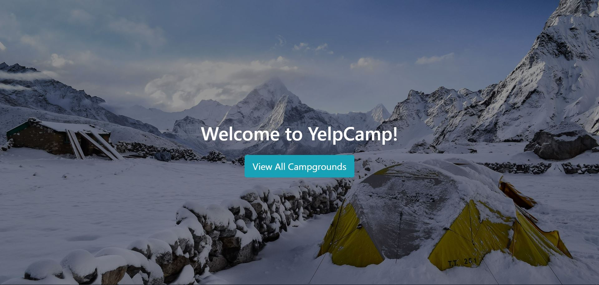

# YelpCamp
Full stack web app where users can create campgrounds and make comments. 
[View online](https://fathomless-fortress-33869.herokuapp.com/)

## Tech Used
HTML5, CSS3, JavaScript, Bootstrap 4, EJS, Node, Express JS, MongoDB, Mongoose, Authentication, Git, Heroku

## Features
-	User authentication via passport (local strategy) 
-	Image upload with multer and cloudinary
-	Password reset with nodemailer
-	Fuzzy search, image animation on landing page, flash messages with connect-flash, time since created with moment JS, etc

## Screenshots
Image animation on landing page:


Home page: 


Campground show page: 


Campground new page:


Comment new page: 


Search bar: 


Sin up: 


Log in: 


Password reset: 


User dashboard: 


## How to Use?
process.env to set:
 - CLOUDINARY_API_KEY, which is cloudinary API key
 - CLOUDINARY_API_SECRET, which is cloudinary API secret
 - GMAILPW, which is the gmail account password 
 - DBURL, which is the database URL 

Nodemailer will require your gmail address and password. Code in routes/index.js: 

```
var smtpTransport = nodemailer.createTransport({
    service: 'Gmail', 
    auth: {
      user: 'theyelpcamp.dev@gmail.com',  //please change to your email address
      pass: process.env.GMAILPW
    }
});
```


(If you like it, don't be shy to click the ★ Star button ;o)
